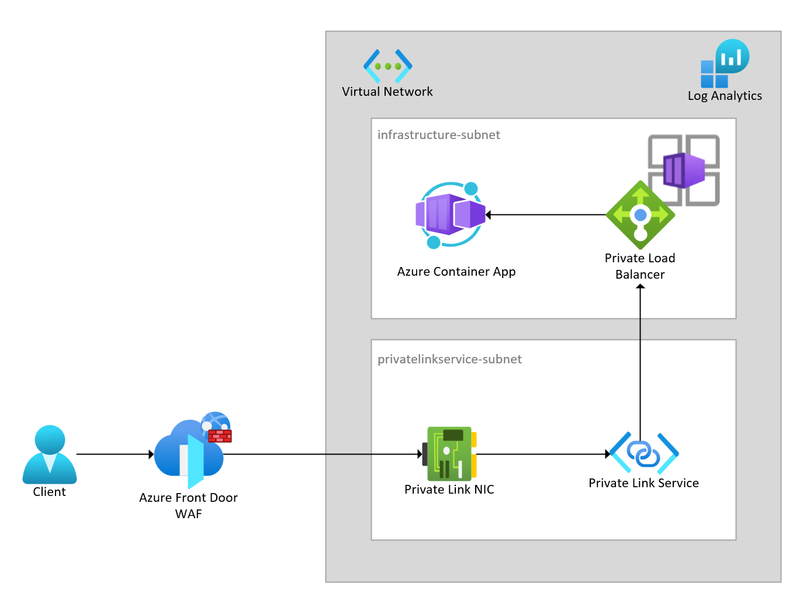

## Azure Container Apps (ACA) and Azure Front Door (AFD) integration

### Overview

Many customers require Web Applications & APIs to only be accessible via a private IP address with a Web Application Firewall on the internet edge, to protect from common exploits and vulnerabilities. Azure Container Apps ingress can be exposed on either a Public or Private IP address. One option is to place Azure Front Door in front of an ACA public endpoint, but currently there is no way (other than in application code) to restrict access to the ACA public IP address from a single Azure Front Door instance. Azure App Service Access restrictions supports this scenario, but unfortunately, there is currently no equivalent access restriction for Azure Container Apps.

To work around this limitation, Azure Private Link Service can be provisioned in front of an internal ACA load balancer. A Private endpoint (NIC with private IP in a virtual network) is connected to the Private Link Service and an Azure Front Door Premium SKU instance can then be used to connect to the private endpoint (known as a Private Origin in AFD). This configuration removes the need to inspect the value of the "X-Azure-FDID" header sent from AFD since only a single AFD instance is connected to the private endpoint, guaranteeing traffic to the ACA environment occurs only from that specific AFD instance. The overall architecture is captured in the diagram below.

### Prerequisites

- Azure subscription
- Ensure either the [AZ CLI](https://learn.microsoft.com/en-us/cli/azure/install-azure-cli) or [Azure PowerShell](https://learn.microsoft.com/en-us/powershell/azure/install-az-ps) module are installed

### Deployment

- The following resources will be deployed:
  - Virtual Network with 2 subnets
  - Resource Group
  - Private Link Service
  - Private Link Endpoint
  - Azure Front Door Premium
  - Azure Front Door WAF policy
  - Azure Container Apps environment
  - Azure Container App
  - Log Analytics Workspace

- Run either the ./deploy.sh Bash script or the ./deploy.ps1 PowerShell scripts to deploy the solution
- Browse to the url displayed at the end of script execution
